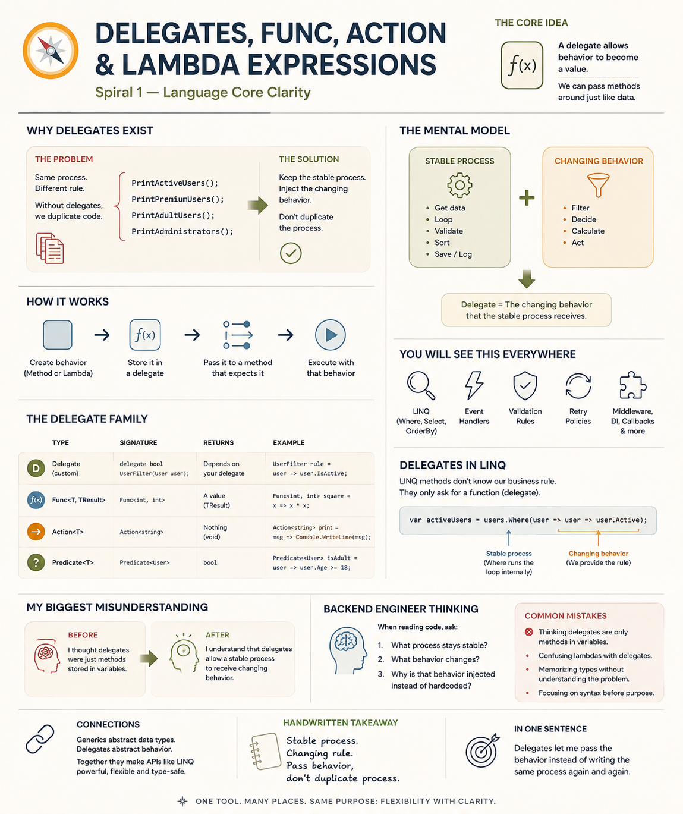
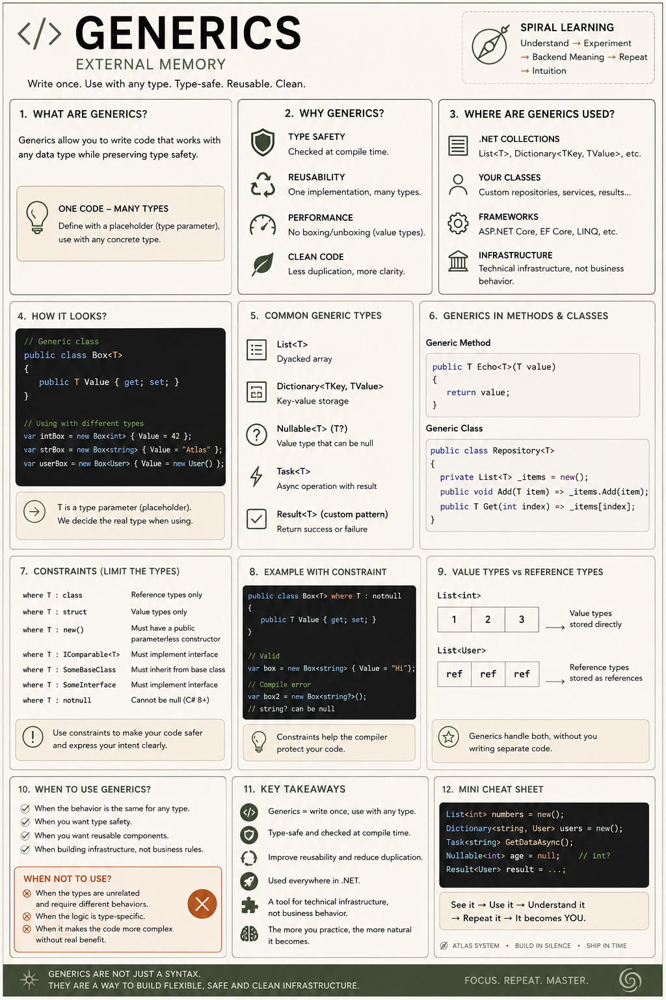
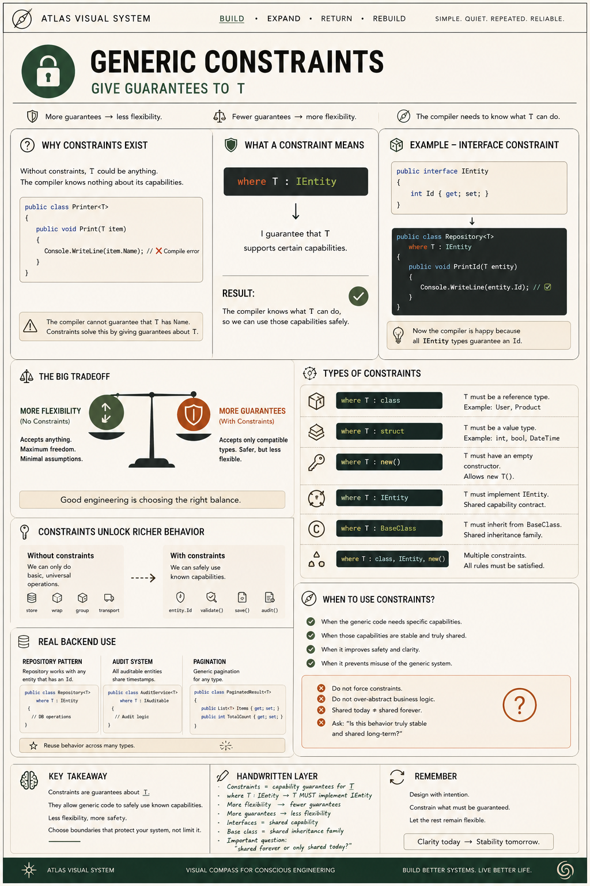
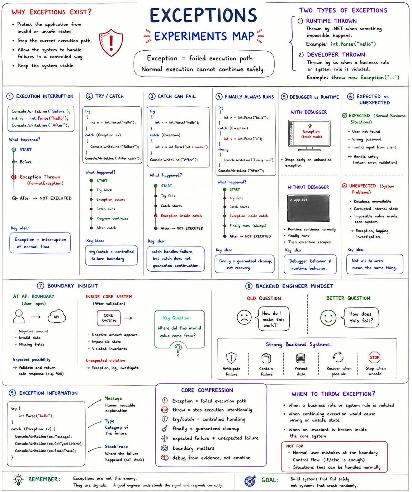
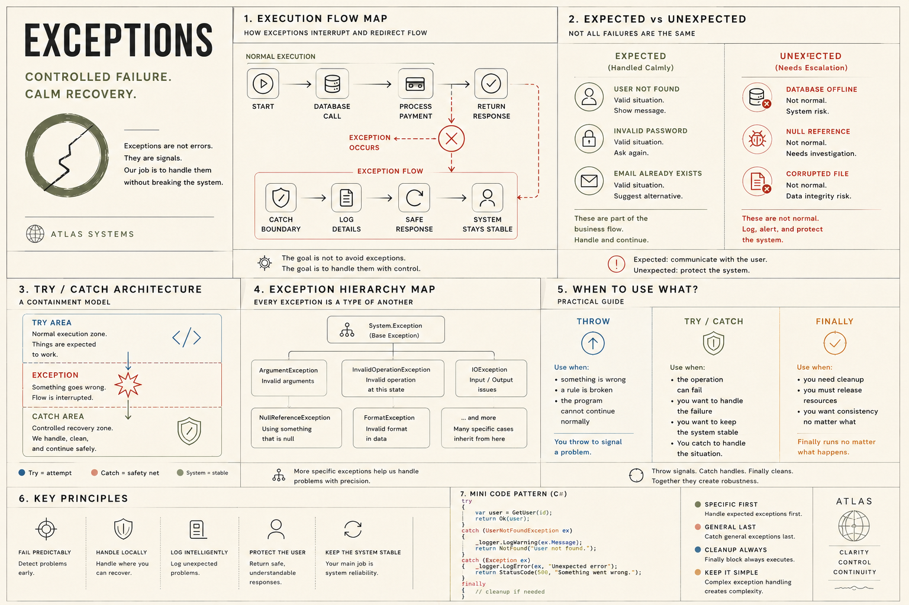
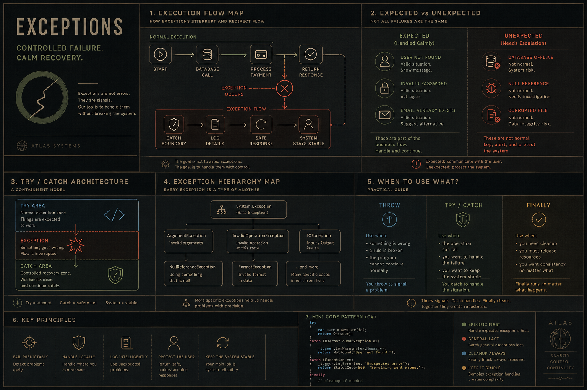
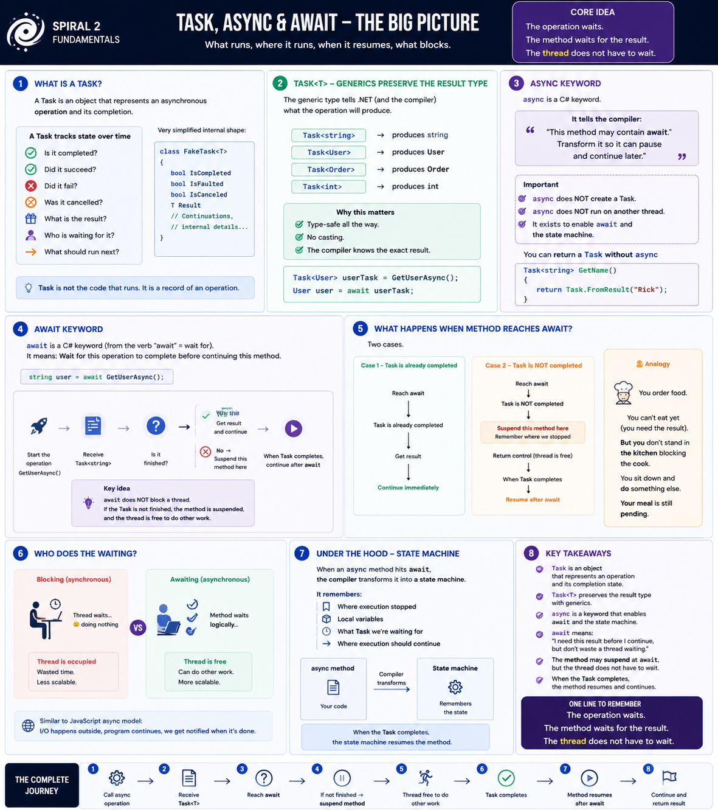
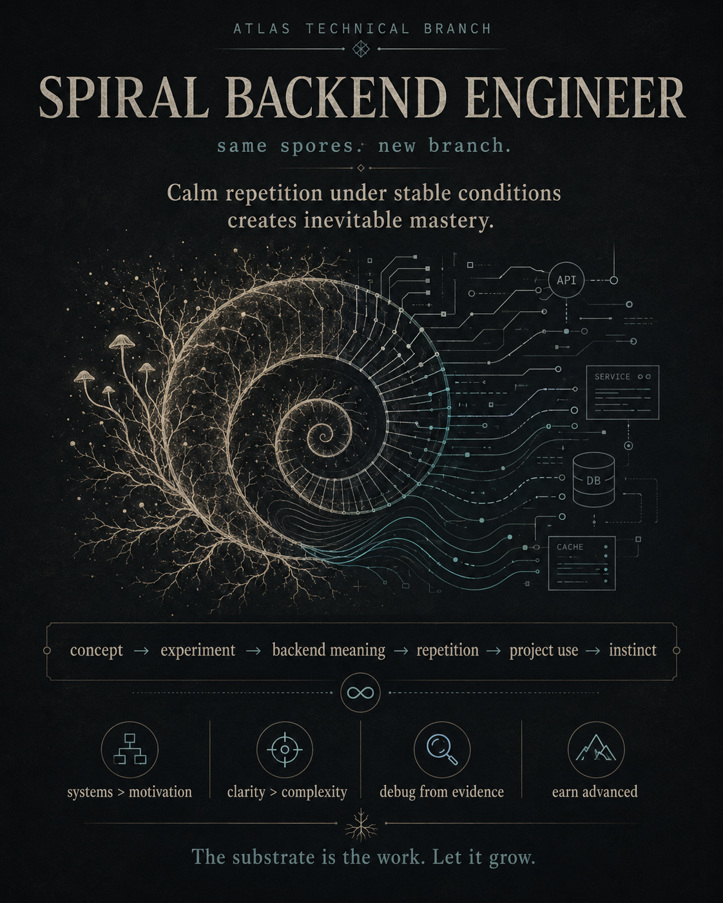
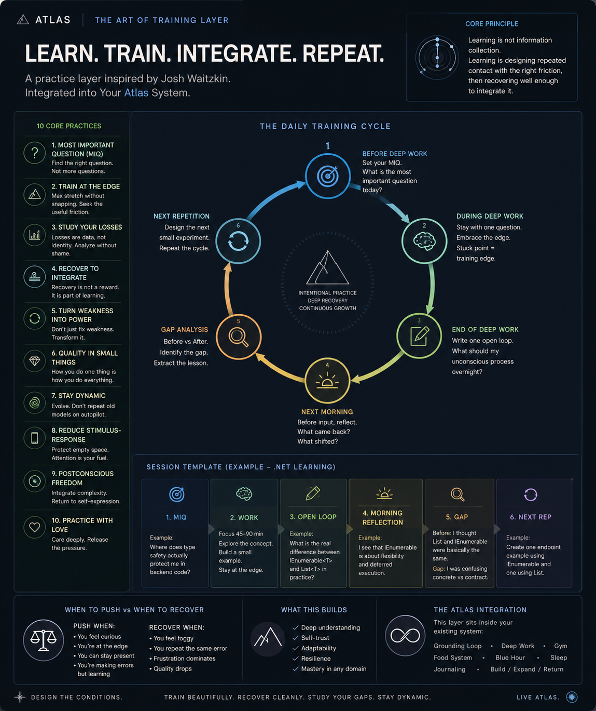

# Visual learning notes

These are visual notes I use to revisit concepts while working through the lab.
They capture my understanding at the time and remain part of an ongoing learning
process. The runnable experiments provide a way to check the ideas in practice.

Click an image to view it at full resolution. The original images are preserved unchanged.

## Language core

| Delegates, Func, Action and lambdas | Generics | Generic constraints |
| --- | --- | --- |
|  |  |  |
| [Delegate experiments](../../01-language-core/LanguageCore/DelegateExperiments.cs) | [Generic experiments](../../01-language-core/LanguageCore/GenericExperiments.cs) | [Constraint experiments](../../01-language-core/LanguageCore/GenericConstraints.cs) |

## Exceptions

The experiment map and the light/dark overview versions are all retained.
Compare them with the [exception experiments](../../01-language-core/LanguageCore/ExceptionExperiments.cs).

| Experiments map | Print version | Dark version |
| --- | --- | --- |
|  |  |  |

## Execution and async

Related: [async experiments and run modes](../../02-async-execution/README.md).

## Learning method

These two posters record the practice approach behind the Spiral method.

| Spiral backend engineer | Learn, train, integrate, repeat |
| --- | --- |
|  |  |
